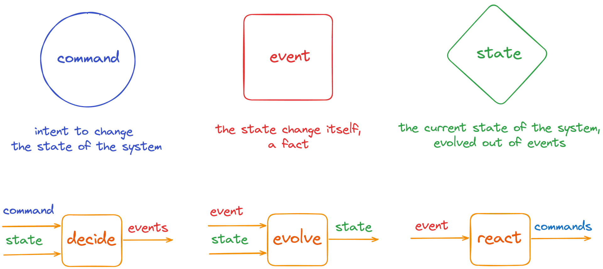
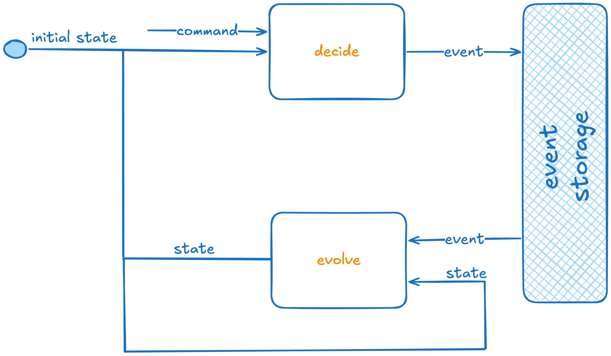

# fmodel-decider-rust

Rust library for modeling deciders (`command handlers`), process managers,
and views (`event handlers`) in domain-driven, event-sourced, or state-stored
architectures with progressive type refinement.



## Table of Contents

- [Getting Started](#-getting-started)
- [Well-Structured Systems Become Agent-Amplifiable Systems](#%EF%B8%8F-well-structured-systems-become-agent-amplifiable-systems)
- [Progressive Type Refinement Philosophy](#-progressive-type-refinement-philosophy)
- [Educational Purpose](#educational-purpose)
- [Two Computation Models](#-two-computation-models)
- [Threading Modes](#-threading-modes)
- [Event Modeling](#-event-modeling)
- [Executable Specifications](#-executable-specifications)
- [Acknowledgments](#-acknowledgments)

## 🚀 Getting Started

### Build

```bash
# Default (multi-threaded, uses Arc + Send + Sync)
cargo build

# Single-threaded (uses Rc, no Send + Sync requirement — better performance in single-threaded runtimes)
cargo build --features single-threaded
```

### Run tests

```bash
# All tests — multi-threaded mode (default)
cargo test

# All tests — single-threaded mode
cargo test --features single-threaded

# A specific test by name
cargo test test_name

# A specific test in single-threaded mode
cargo test --features single-threaded test_name

# Show output from passing tests
cargo test -- --nocapture
```

> **Tip:** The `single-threaded` feature swaps `Arc` for `Rc` and removes `Send + Sync` bounds on
> all behavioral components. Run both modes in CI to catch issues in each configuration:
> ```bash
> cargo test && cargo test --features single-threaded
> ```

---

## 🏗️ Well-Structured Systems Become Agent-Amplifiable Systems

When the structure is right, agents can amplify it. These images show how the pieces connect — from running code to storage:

At runtime, the decider loop is a pure cycle: `initial state` → `decide(command, state)` → events are persisted to the event store → `evolve(state, event)` reconstructs state for the next command. No side effects in the domain logic — all I/O is at the boundary.


*Decision Logic — pure deciders that enforce business rules with zero side effects*

## 🎯 Progressive Type Refinement Philosophy

This library demonstrates how to evolve from **general, flexible types** to
**specific, constrained types** that better represent real-world information
systems. Starting with the most generic interfaces that support all possible
type combinations, we progressively add constraints that:

- **Increase semantic meaning** - Each refinement step adds domain-specific
  behavior
- **Reduce complexity** - Constraints eliminate impossible states and invalid
  operations
- **Improve usability** - More specific types provide better APIs and clearer
  intent
- **Enable optimizations** - Constraints allow for more efficient
  implementations

This approach mirrors how we model information systems: beginning with broad
concepts and iteratively refining them into precise, domain-specific
abstractions that capture business rules and invariants.

## Educational Purpose

This library serves as both a **practical toolkit** and an **educational
resource** for understanding:

- **Functional/Data oriented domain modeling** patterns in Rust
- **Progressive type refinement** as a design methodology
- **Event-sourced** and **state-stored** computation patterns

```rust
// 1. View: Pure state evolution
pub trait ViewTrait<Si, So, Ei> {
    fn evolve(&self, state: &Si, event: &Ei) -> So;
    fn initial_state(&self) -> Si;
}

// 2. Decide: Decision-making capabilities
pub trait DeciderTrait<C, Si, So, Ei, Eo>: ViewTrait<Si, So, Ei> {
    fn decide(&self, command: &C, state: &Si) -> Result<Self::Events, Self::Error>;
}

// 3. Automate: `To-Do` list management
pub trait ProcessTrait<AR, Si, So, Ei, Eo, A>: DeciderTrait<AR, Si, So, Ei, Eo> {
    fn react(&self, state: &Si, event: &Ei) -> Self::Actions;   // Filtered ToDo list
    fn pending(&self, state: &Si) -> Self::Actions;             // Complete ToDo list
}

// 4. Implementations with progressive constraints:
impl ViewTrait<S, S, E> for Projection<...>                    // View/Projection
impl DeciderTrait<C, S, S, E, E> for AggregateDecider<...>     // DDD Aggregates  
impl DeciderTrait<C, S, S, Ei, Eo> for DCBDecider<...>         // DCB
impl ProcessTrait<AR, S, S, E, E, A> for Process<...>          // To-Do list processes (manager)
impl ProcessTrait<AR, WorkflowState<T>, WorkflowState<T>, WorkflowEvent<T>, WorkflowEvent<T>, A> for Workflow<...>  // Task workflows
```

## 🔄 Two Computation Models

### 1. Event-Sourced Computation (`EventComputationTrait`)

**State is reconstructed from event history. Events are saved.**

Applies to: `AggregateDecider`, `DCBDecider`, `Process`

```rust
use fmodel_decider_rust::{AggregateDecider, EventComputationTrait};

// Load historical events from event store
let events = vec![Event::Created, Event::Updated(42)];

// Compute new events based on command and history
let new_events = decider.compute_new_events(&events, &command)?;

// Append new events to event store
append_events_to_store(aggregate_id, new_events);
```

### 2. State-Stored Computation (`StateComputationTrait`)

**Current state is saved, overwriting the history.**

Applies to: `AggregateDecider`, `Process`

> `DCBDecider` does **not** implement `StateComputationTrait` because its input event type (`Ei`)
> and output event type (`Eo`) differ — the output events cannot be folded back into state through
> the same `evolve` function.

```rust
use fmodel_decider_rust::{AggregateDecider, StateComputationTrait};

// Load current state from database
let current_state = load_state_from_db(entity_id);

// Compute new state based on command
let new_state = decider.compute_new_state(current_state, &command)?;

// Save new state to database
save_state_to_db(entity_id, new_state);
```

## 🧵 Threading Modes

Feature-gated thread safety optimization:

```toml
# Multi-threaded (default) - Uses Arc, enforces Send + Sync
[dependencies]
fmodel-decider-rust = "0.1.0"

# Single-threaded - Uses Rc, better performance
[dependencies]
fmodel_decider_rust = { version = "0.1.0", features = ["single-threaded"] }
```

## 📐 Event Modeling

The domain is captured as an [Event Model](https://eventmodeling.org/) — a timeline of commands (blue), events (red), and views (green) across swim lanes (Customer, Admin). Each command/event pair maps to one decider in the codebase.


*Event Modeling — capturing the domain as a flow of commands, events, and views*

## ✅ Executable Specifications

Every decider is tested with a given-when-then specification. Events are folded (`evolve`) into state, a command (`decide`) produces new events or an error. The left side shows the success path, the right side the error path — both derived directly from the event model above.


*Executable Specifications — translating the model into testable, runnable specs*

`src/specification.rs` provides four fluent DSLs covering every component in the hierarchy:

### `AggregateDeciderTestSpecification`

Supports both event-sourced and state-stored testing for `AggregateDecider` and `Process`.

```rust
use fmodel_decider_rust::specification::AggregateDeciderTestSpecification;

// Event-sourced: fold history, assert new events
AggregateDeciderTestSpecification::default()
    .for_decider(&decider)
    .given(vec![AccountEvent::AccountOpened { id: 1, initial_balance: 100 }])
    .when(AccountCommand::Deposit { id: 1, amount: 50 })
    .then(vec![AccountEvent::MoneyDeposited { id: 1, amount: 50 }]);

// Error path
AggregateDeciderTestSpecification::default()
    .for_decider(&decider)
    .given(vec![AccountEvent::AccountOpened { id: 1, initial_balance: 50 }])
    .when(AccountCommand::Withdraw { id: 1, amount: 100 })
    .then_error(AccountError::InsufficientFunds);

// State-stored: provide current state, assert resulting state
AggregateDeciderTestSpecification::default()
    .for_decider(&decider)
    .given_state(Some(AccountState { id: Some(1), balance: 100 }))
    .when(AccountCommand::Deposit { id: 1, amount: 50 })
    .then_state(AccountState { id: Some(1), balance: 150 });
```

### `DCBDeciderTestSpecification`

For `DCBDecider` where input events (`Ei`) and output events (`Eo`) differ across consistency boundaries.

```rust
use fmodel_decider_rust::specification::DCBDeciderTestSpecification;

DCBDeciderTestSpecification::<_, MyState, _, _, _, _>::default()
    .for_decider(&dcb_decider)
    .given(vec![UpstreamEvent::OrderPlaced { order_id: 1, amount: 100 }])
    .when(TransformCommand::ProcessOrder { order_id: 1 })
    .then(vec![DownstreamEvent::PaymentRequested { order_id: 1, amount: 100 }]);
```

### `ProjectionTestSpecification`

For `Projection` (read-side views): no command, just fold events into state.

```rust
use fmodel_decider_rust::specification::ProjectionTestSpecification;

ProjectionTestSpecification::default()
    .for_projection(&projection)
    .given(vec![
        UserEvent::UserRegistered { id: 1, name: "Alice".into() },
        UserEvent::UserUpdated { id: 1, name: "Alice Smith".into() },
    ])
    .then(expected_state);
```

### `ProcessTestSpecification`

For `Process`: extends the decider assertions with `then_react` (actions triggered by the last event) and `then_pending` (all outstanding actions for the current state). Assertions are chainable.

```rust
use fmodel_decider_rust::specification::ProcessTestSpecification;

ProcessTestSpecification::default()
    .for_process(&process)
    .given(vec![
        TaskEvent::TaskAdded { id: 1, title: "Task 1".into() },
        TaskEvent::TaskInProgress { id: 1 },
    ])
    .when(TaskActionResult::TaskStarted { id: 1 })
    .then(vec![TaskEvent::TaskInProgress { id: 1 }])
    .then_react(vec![TaskAction::NotifyManager { task_id: 1 }])
    .then_pending(vec![]);
```

## 🙏 Acknowledgments

- Inspired by [fmodel-decider](https://github.com/fraktalio/fmodel-decider) and progressive type refinement philosophy
- Special credits to `Jérémie Chassaing` for his [research](https://www.youtube.com/watch?v=kgYGMVDHQHs) and `Adam Dymitruk` for [Event Modeling](https://eventmodeling.org/).

---
Created with :heart: by [Fraktalio](https://fraktalio.com/)
